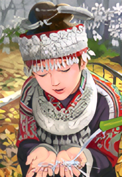
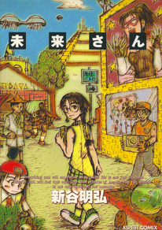

<br>

<br>

<br>


# 🌌 **Edge Guided Learning for Image Super-resolution with Realistic Textures** 
<br>

<br>

### **Code for our IEEE WCCI 2022 paper Edge Guided Learning for Image Super-resolution with Realistic Textures**

<br>

## 🍅 &nbsp;&nbsp;**Run**

<br>

<font size=3> The pretrained models and test codes are uploaded, now you can run test.py to get results in the challenge. Just like:</font>

<br>

```
    #python test.py pathToModel datasetsName

    python test.py checkpoints/EdgeSRN_x4.pth Set14
```
<br>

<font size=3> You can also get the result images in "page_results" folder we provided.</font>

<br>

## 🍅 &nbsp;&nbsp;**Requirement**

<br>

<font size=3> The code was tested on python3.9, linux.</font>

<br>

## 🍅 &nbsp;&nbsp;**Citing**

<br>

<font size=3> The code is free for academic/research purpose. Please kindly cite our work in your publications if it helps your research.</font>

<br>

```

@article{
  title={Edge Guided Learning for Image Super-resolution with Realistic Textures},
  author={Z. Li, Z. Zhong, Z. Chen, G. Yao, X. Chen, W. Huang},
  conference={The 2022 International Joint Conference on Neural Networks (IJCNN). IEEE, Padua, Italy. 2022, 18-23 July},
  year={2022}
}

@inproceedings{li2022edge,
  title={Edge Guided Learning for Image Super-resolution with Realistic Textures},
  author={Li, Zhan and Zhong, Ziyi and Chen, Zhitao and Yao, Gengqi and Chen, Xi and Huang, Weijian},
  booktitle={2022 International Joint Conference on Neural Networks (IJCNN)},
  pages={1--8},
  year={2022},
  organization={IEEE}
}

```
<br><br>

## 🍅 &nbsp;&nbsp;**Example (Left is LR, Right is Ours)**

<br>

<div align=center>
<center class="half">
  
  &nbsp;&nbsp;
</center>
</div>

<div align=center>
<center class="half">
  
  &nbsp;&nbsp;
</center>
</div>

<div align=center>
<center class="half">
  
  &nbsp;&nbsp;
</center>
</div>

<div align=center>
<center class="half">
  
  &nbsp;&nbsp;
</center>
</div>

<div align=center>
<center class="half">
  
  &nbsp;&nbsp;
</center>
</div>

<div align=center>
<center class="half">
  
  &nbsp;&nbsp;
</center>
</div>

<br><br>
